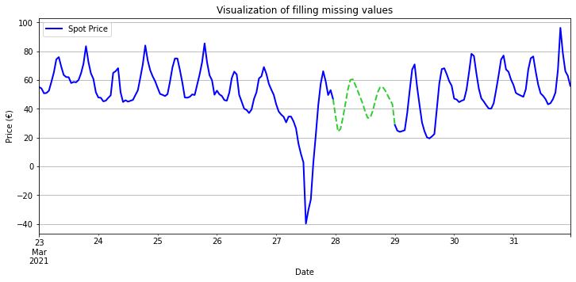

# Documentation for ARIMA

## Pre-processing

### Missing Value processing

There are missing values for **2:00 - 3:00** at the end of March each year, which may be the annual maintenance time. Then, assume that the missing values are likely to be similar to the previous values (one timestep before the missing value). Our strategy to deal with the missing values from 2011 to 2020 is using the next observation to fill the gap. But for ** the year 2021**, the values of the entire **March 28th** were missing (24 continuous data points), therefore, for that particular day, we need to fill the average spot price of the previous day or forecast the missing values based on historical data. Obviously, simple processing like filling with average spot price or linear interpolation would lose much information. Thus, we used simple autoregression model to fill the missing value for this paticular day.

### Feature Engineering (Feature Extraction + Feature Selection + Interpretation)

Basically, simple ARIMA model is just a linear model with the values of historical timesteps as features. In order to predict something with very complex underlying data structure (such as electricity price in our case), we need to add more information to the model. There are several ways to do this.

Feature Extraction:

- We can use some related timeseries as exogenous variables. (like weather condition, electrcitiy production/consumption, etc.) 

  However,
  
  - the data sources are different. It caused different timestep. (label's timestep is hour, variables' timestep could be day, month)
  - the available timeperiods are different. (Our label is from 2011, ...)
  - can not obtain from server (no available API, just csv).
- Therfore, the better way is extracting new features from spot price.
  > How to extract features:
  >
  > - Split the spot price into many small pieces using rolling window technique. (For the **window size**, I used 24, because the electricity prices seem to change in cycles of one day, one week, and one month, etc. Extracting feature from 1 day can probably obtain most detailed information.)
  > - For every window, I used python package "tsfresh" to extract 786 features (including coefficient of Fourier Transformation, Wavelet Transformation, and many other statistical features)

The idea is that we extract enough features (non-linearity) so that our model overfits the data, then we select the most important features to improve the generalization performance of our model.

Feature selection:

- 1.layer feature filtering using Kendall rank correlation coefficient with significant level 0.05. (after that we still have 232 features, we need to further select features)
- 2.layer feature selection: I used Lasso Regression and just keep the features whose coefficeints are not zero. (In Lasso regression, discarding a feature will make its coefficient equal to 0)

## Cross-Validation

- Validation area: only 2021 (because ARIMA is a short-term forecast model, recent historical data makes more sense)
- Validation method: Sliding window. (This approach to CV slides a window over the training samples while using several future samples as a test set. While similar to the Rolling Window CV, it differs in that the train set does not grow, but rather shifts.)

## Training length optimization

For ARIMA, the length of training set can significantly influence the result. Basically, it asks how long should we consider backward to gain insight into the short-term future.

- 1 - smape as performance metric
- training length from 1 day to 6 month

- performance increasing before 2 month (mean increases, standard deviation decreases) -> training data less than 2 months does not have enough information
- performance decreasing before 2 month -> overfitting

> we can see ARIMA is short-term forecast method, training set longer than 2 months makes no sense.

## Lasso parameter (alpha) optimization

We select the feature using Lasso Regression in the 2.layer feature selection. The number of remained features can be adjusted by changing the hyperparameter (alpha) of Lasso Regression. (alpha larger -> stronger penalty -> less remained features; alpha smaller -> weaker penalty -> more remained features)

More features does not neccesarily mean better performance. It could cause overfitting and longer time for forecasting. Therefore, we want to reduce the number of features as much as possible while maintaining the model performance.

- the performance is almost the same before alpha = 2
- but the feature number reduces
- and less fitting time and prediction time if we have less features. (because the features need to be calculated in real time while forecasting the spot price)

- at last, we just used the top 17 features

## Discussion

- very good at short-term prediction (1 day prediciton)
- but long-term not good
- for some special case (spot price suddenly reduces to a negative value), ARIMA can not provide a meaningful prediction.
