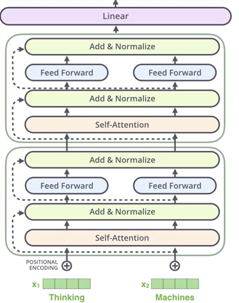
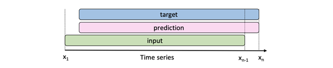
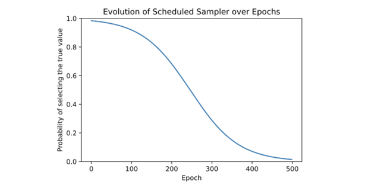

# Documentation for Transformer

## Requirements
1. PyTorch
2. NumPy
3. Pandas
4. tqdm
5. matplotlib
6. sklearn

## Data

The raw data with missing value process is generated in ARIMA folder. [see here](./Data/final_final_mean_new_new.csv).

The [training data](./Data/data_train_1.csv) is from 2019-2020, the [test data](./Data/data_pe_test_uni_1.csv) is from 2021 with positional embedding.

## Preprocessing
Generate positional embedding.

## Model Structure
We use Decoder-only Transformer, which is inspired by GPT-2.

## Train with Sampling
Train the transformer with sampling. We input a series x1~xn-1, and train the model to output a series one time step ahead.

Teacher forcing: The concept of feeding the model the true value at each new step, rather than the last predicted output, is known as teacher forcing

Drawback of Teacher forcing: at each new prediction, the model may make minor mistakes, but it will in any case receive the true value in the next step, meaning that these mistakes never contribute significantly to the loss. The model only has to learn how to predict one time step in advance. However, during inference, the model now must predict longer sequences.

Scheduled Sampling: In order to gently bridge this gap, a sampling method is used, inspired by Bagnio’s “Scheduled Sampling for Sequence Prediction with Recurrent Neural Networks”. The sampling rate evolves over time, starting with a high probability of selecting the true value initially, as in classical teacher forcing, and gently converging towards sampling purely from the models output, to simulate the inference task.
 
## Inference
Use the data from 2021 to test the performance of model. The prediction results are saved in [save_predictions](./save_predictions).

## Discussion

- acceptable at short-term prediction (1-hour, 1-day prediction)
- long-term not good
- for some special case (spot price suddenly reduces to a negative value), Transformer can also not provide a meaningful prediction.

## How to run

`python main.py --device [YOUR DEVICE('cpu'/ 'cuda')]`

including training and inference.
